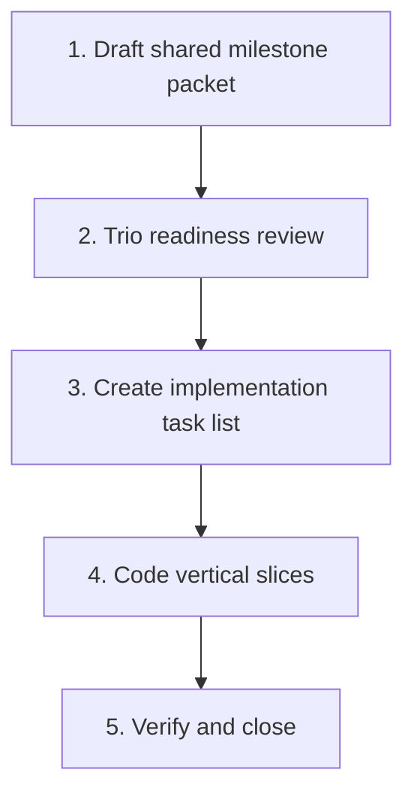

# AI Investment Committee Execution Plan

This document defines how roadmap milestones in `BUILD_PLAN.md` move from
strategy into implementation. It is the operating playbook for avoiding scope
drift while preserving product, engineering, and design judgment.

## 1. Product Trio Operating Model

Milestones are planned by a Product Trio, but the trio works in one shared
milestone packet. The packet lives at `docs/milestones/m[X]_spec.md` and is the
single source of truth for that milestone.

| Role | Ownership | Required contribution |
| :--- | :--- | :--- |
| Product Manager | Outcome, sequencing, value, edge cases | Goals, user workflows, in/out of scope, acceptance criteria |
| Principal Engineer | Architecture, data integrity, testability | Types, persistence, normalization, helper logic, verification plan |
| Product Designer | Workflow, hierarchy, interaction states | Entry points, empty/active/error states, responsive behavior, copy-sensitive UI |

The trio may discuss separately, but it must converge into the same packet
before code starts. Separate PRD, TDD, and design files are allowed only as
temporary scratch notes; they are not authoritative.

## 2. Milestone Lifecycle

For every roadmap milestone:



### Step 1: Draft Shared Milestone Packet

Create or update `docs/milestones/m[X]_spec.md` with:

- product outcome and non-goals
- user workflows and UI states
- data rules, schema impact, and compatibility rules
- implementation slices
- tests, browser checks, and acceptance criteria

### Step 2: Trio Readiness Review

No code starts until the packet is decision-complete:

- PM can explain the user-visible behavior and acceptance criteria.
- ENG can implement without inventing schema, migration, or persistence rules.
- DESIGN can describe each touched screen state without needing new product
  decisions.
- Known deferrals are named explicitly and linked to a later milestone.

### Step 3: Implementation Task List

Create a short task list for the active milestone only. Prefer vertical slices
that produce testable behavior over broad file-by-file chores.

### Step 4: Code Vertical Slices

Implement one slice at a time. Each slice should include the relevant domain
logic, UI wiring, and tests when practical, instead of leaving validation until
the end.

### Step 5: Verify and Close

Run the global quality gates and the milestone-specific acceptance checks. Close
the milestone only when the packet's acceptance criteria are met.

## 3. Milestone Packet Template

Each packet should use this structure:

```markdown
# Milestone [X] Specification: [Milestone Title]

## Summary
- Outcome, user value, and explicit non-goals.

## Product And UX Contract
- Workflows, entry points, validation behavior, UI states, and copy-sensitive
  decisions.

## Engineering Contract
- Types, data flow, persistence, normalization, export/import impact, and
  compatibility rules.

## Implementation Slices
- Small vertical slices in execution order.

## Verification
- Unit tests, integration tests, browser QA, and acceptance criteria.

## Assumptions And Deferrals
- Defaults chosen, known limits, and what belongs to a later milestone.
```

## 4. Milestone Pipeline

| Milestone | Packet Status | Dev Status | Notes |
| :--- | :--- | :--- | :--- |
| M1 - IC Primitives + Thesis Intake | Implemented | Verified | Built from `docs/milestones/m1_spec.md`: shared IC thesis memory, review-state defaults, review status visibility, recurring/manual review behavior, malformed legacy IC normalization, and canonical `m1` browser QA coverage. `npm test`, `npm run lint`, `npm run build`, isolated `node scripts/run.js qa m1`, and the full canonical `node scripts/run.js qa` sweep passed on 2026-06-18 with retained evidence at `issues/qa/2026-06-18T04-15-23-825Z/report.json`. Browser QA used the fallback Edge/CDP harness because the in-app browser helper is intentionally deferred. |
| M6 - Decision Ledger | Implemented | Verified | Built from `docs/milestones/m6_spec.md`: decision history, analysis/portfolio ledger UI, legacy normalization, snapshots, outcome reviews, Library badges, and backup round-trip tests. `npm run lint -- --quiet`, `npm test`, `npm run build`, and browser QA passed. Browser QA used local Playwright + Edge because the in-app browser helper still crashes during setup in this environment. |
| M3 - Field Provenance | Implemented | Verified | Built from `docs/milestones/m3_spec.md`: stock provenance types/helpers, lockable sourced facts, candidate blocking, manual promotion, saved inspector provenance, legacy normalization, intake eval fixture updates, `npm test`, `npm run build`, and browser QA passed. |
| M4 - Evidence Locker | Implemented | Verified | Built from `docs/milestones/m4_spec.md`: first-class `Analysis.evidence`, pure evidence helpers, legacy candidate promotion on read, inline Evidence Locker UI, source/thesis links, backup/import tests, and M6 snapshot coverage. `npm test`, `npm run lint`, `npm run build`, isolated `m6`, expected-failure `broken-m4`, and the full canonical `node scripts/run.js qa` sweep passed on 2026-06-16. |
| M2 - Manual Asset Entry | Implemented | Verified | Built from `docs/milestones/m2_spec.md`: manual `valuationMode`, nullable engine fields, manual metadata/risk prompts, dual `+ NEW ANALYSIS` / `+ MANUAL ASSET` entry points, manual thesis/detail editing, review-cadence editing, backup/snapshot compatibility, portfolio-picker exclusion, and a canonical `m2` QA scenario. `npm test`, `npm run lint`, and `npm run build` passed, and isolated browser QA `node scripts/run.js qa m2` passed on 2026-06-17 with retained evidence at `issues/qa/2026-06-17T05-02-10-481Z/report.json`. Browser QA used the fallback Edge/CDP harness because the in-app browser helper still crashes during setup in this environment. |
| M5 - IC Agenda Dashboard | Implemented | Verified | Built from `docs/milestones/m5_spec.md`: pure agenda derivation helpers, Agenda home/default landing view, sidebar Agenda entry, ranking/filter coverage, and canonical `m5` browser QA coverage. `npm test`, `npm run lint`, `npm run build`, and the canonical `node scripts/run.js qa` sweep passed on 2026-06-17 with retained evidence at `issues/qa/2026-06-17T08-58-14-514Z/report.json`. Browser QA used the fallback Edge/CDP harness because the in-app browser helper still crashes during setup in this environment. |

## 5. Quality Gates

Every milestone must pass these global gates:

1. Lint and build: `npm run lint` and `npm run build` in `app`.
2. Unit tests: `npm run test` in `app`, including new pure-helper tests.
3. Data integrity: legacy normalization succeeds, and backup export/import
   preserves milestone data.
4. UI verification: touched screens are checked in browser for empty, active,
   invalid, and success states.
5. Milestone-specific checks: the packet's verification section must pass before
   the milestone is marked complete.

If the primary browser helper is broken but the app is healthy, complete browser
verification through a documented fallback path and record that method in the
milestone/status docs. See `docs/qa/BROWSER_QA_HARNESS.md`.

For M6 specifically, the quality gate includes decision-history round-trip,
legacy-decision compatibility, due-review behavior, and analysis/portfolio
browser checks.
