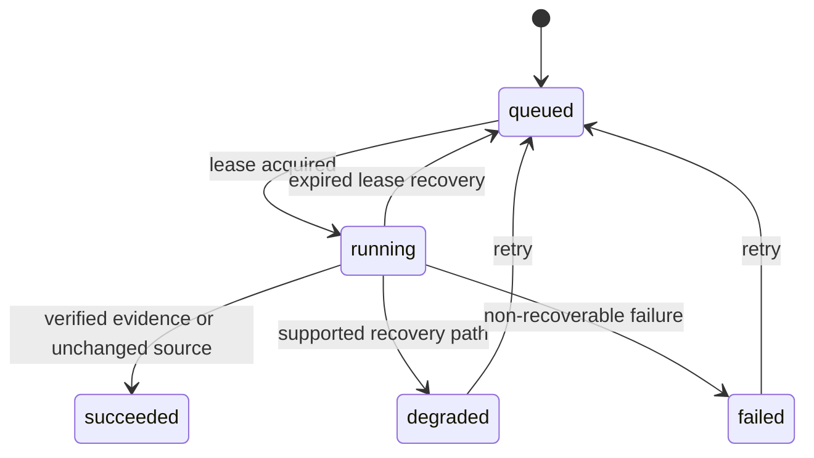

# JP Invest Codebase Map

This is the canonical orientation map for builders and reviewers. Generated
module facts live in [`generated/code-index.json`](generated/code-index.json);
product and architecture authority remains in milestones, decisions, and
`.agents/` policy.

## Architecture Layers

| Layer | Ownership | Primary paths |
|---|---|---|
| App routes | HTTP validation and response mapping | `app/api/`, `app/c/`, `app/portfolio/` |
| UI | Conversation workspace, research states, portfolio briefing | `components/` |
| Domain contracts | Zod inputs and DTOs crossing boundaries | `lib/domain/contracts.ts` |
| AI boundary | Project-owned provider contract and deterministic mock | `lib/ai/` |
| Portfolio logic | Priority queue scoring, briefing queries | `lib/portfolio/`, `db/queries.ts#getPortfolioBriefing` |
| Research orchestration | Jobs, ingestion, citation pipeline, snapshots | `lib/research/` |
| Source adapters | SEC, IDX, issuer, and synthetic fixtures | `lib/research/adapters/` |
| Persistence | Drizzle schema, queries, migrations, external SQLite | `db/` |
| Support scripts | Environment loading, evaluation harness | `scripts/dotenv-quiet.ts`, `scripts/eval-*.ts` |
| Verification | Unit, integration, live opt-in, and browser checks | `tests/` |

Route handlers validate transport input and delegate. Business behavior belongs
in domain or research services. Only server-side modules may open SQLite, read
source bytes, or use credentials.

## Data Relationships

```text
Conversation 1 -> many Messages
Conversation 0..1 -> Thesis
Thesis 1 -> many Assumptions
Thesis 1 -> many Decisions
Assumption 1 -> 1 ResearchJob
Assumption 1 -> many Evidence
ResearchJob many <-> many SourceSnapshots via ResearchJobSources
SourceSnapshot 1 -> many SourceDiscoveries
Market + ticker -> SourceCursor
IngestionRun + IngestionLease coordinate periodic refresh
PortfolioPosition many -> 0..1 Thesis
PortfolioPosition 1 -> many PortfolioAlerts
  (PortfolioAlert.documentHash -> SourceSnapshot.documentHash)
Thesis 1 -> many Assumptions (for briefing priority scoring)
Thesis 1 -> many Decisions (for staleness calculation in priority queue)
```

Raw source bytes are immutable and content-addressed outside the repository.
Evidence stores verified extraction provenance; assumptions do not become
verified merely because exact evidence exists.

## Research Job State Machine



## Critical Flows

### Thesis to exact Evidence

```text
Chat input
  -> validated ThesisDraft
  -> explicit confirmDraft
  -> Thesis + Assumptions + queued ResearchJobs
  -> processResearchJobs
  -> CitationPipeline
  -> SourceAdapter discovery/fetch
  -> immutable SourceSnapshot
  -> deterministic document extraction
  -> candidate ranking
  -> exact verifier
  -> Evidence(exact_verified, interpretation=pending)
```

### Portfolio Briefing (Priority Queue & Status Index)

```text
getPortfolioBriefing query
  -> all PortfolioPositions (leftJoin Thesis for conversationId)
  -> grouped SQL aggregates:
     - unread PortfolioAlerts per position
     - latest Decision.createdAt per thesis
     - existence of challenged Assumptions per thesis
  -> calculatePriorityScore (alerts, staleness, challenged)
  -> sorted descending by priorityScore
  -> returned as PortfolioHoldingQueueItem[] for:
     - TopTenQueue: sidebar briefing of top 10 holdings
     - StatusIndex: full sortable/filterable table at /portfolio
```

### Periodic official-source ingestion

```text
Windows Task Scheduler or protected local endpoint
  -> refreshOfficialSources
  -> database ingestion lease
  -> active tracked theses
  -> queued reusable ResearchJobs
  -> source cursor + known-document check
  -> fetch only new document bytes
  -> snapshot/evidence deduplication
  -> IngestionRun result + next scheduled state
```

## Critical Invariants

- M001 private data and SQLite remain local under ADR-0006.
- Mock research is the deterministic default; live checks are opt-in.
- Unit, build, and browser tests must not make live source or provider calls.
- Official source URLs and redirects are allowlisted and fail closed.
- Unverified candidates never become durable Evidence.
- `exact_verified` Evidence keeps interpretation `pending` and the assumption
  unchanged until a separate governed interpretation or user action.
- Portfolio positions and automated ingestion alerts are local-only under DEC-0009 and never routed to external providers.
- Portfolio briefing (`getPortfolioBriefing`) links positions to conversations
  via thesis, never to thesis directly (the `/c/[id]` route resolves conversation
  ids).
- Migrations are committed and preceded by an external database backup.
- Environment variables are loaded quietly (dotenv `quiet: true`) to suppress
  upstream promotional tips; errors still surface through separate logging
  paths.
- Generated code intelligence is derived navigation data, never authority.

## Task Routing

| Task | Read first | Required checks |
|---|---|---|
| Product scope or workflow | `ACTIVE_MILESTONE.md`, active milestone packet, product decisions | acceptance/eval review |
| Next.js route or component | relevant `node_modules/next/dist/docs/`, route/component, contracts | `verify:full` when user-visible |
| Domain or DTO change | contracts, schema, affected routes/UI | typecheck, unit/integration, build |
| Database or migration | `db/schema.ts`, prior migrations, ADR-0006 | migration/backup tests, full standard verify |
| Portfolio briefing or priority queue | `lib/portfolio/priorityQueue.ts`, `db/queries.ts#getPortfolioBriefing`, schema | `tests/portfolio-briefing.test.ts` coverage, standard verify, link resolution (conversationId, not thesisId) |
| Portfolio UI (queue/index) | `components/TopTenQueue.tsx`, `app/portfolio/page.tsx`, briefing route | `verify:full` with Playwright, sorting/filtering correctness, refresh-on-sync behavior |
| Research source adapter | adapter types, HTTP client, pipeline, source tests | adapter tests, standard verify, opt-in live smoke when authorized |
| Research jobs or ingestion | service, ingestion, schema, scheduler scripts | unit/integration, standard verify, local operational check if scheduling changes |
| Learning promotion | `.agents/LEARNING.md`, candidate, index, promotion registry | independent review, `status:check`, `git diff --check` |
| Release/checkpoint | `.agents/RELEASE.md`, verification summary, active/checkpoint docs | `verify:full`, retained evidence review |

## Status And Evidence

- Current phase and next action: [`../ACTIVE_MILESTONE.md`](../ACTIVE_MILESTONE.md)
- Detailed handoff: [`../SESSION_CHECKPOINT.md`](../SESSION_CHECKPOINT.md)
- Decision navigation: [`decisions/INDEX.md`](decisions/INDEX.md)
- Learning authority: [`learning/INDEX.md`](learning/INDEX.md)
- Retained release evidence: [`evidence/releases/`](evidence/releases/)
