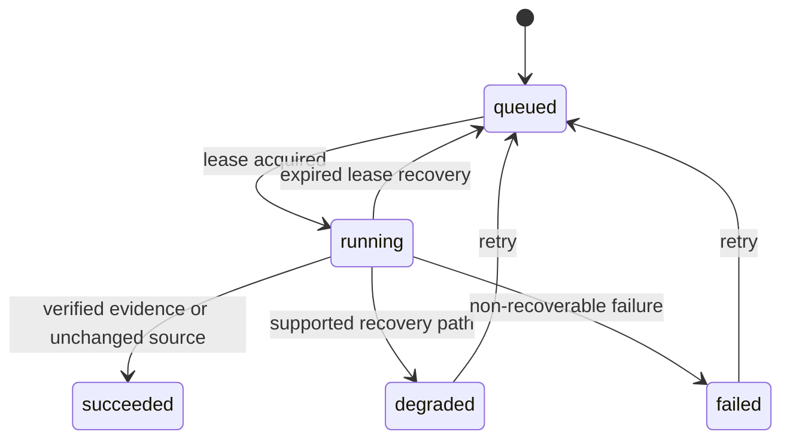
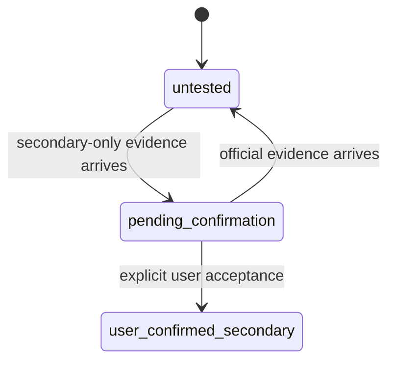

# JP Invest Codebase Map

This is the canonical orientation map for builders and reviewers. Generated
module facts live in [`generated/code-index.json`](generated/code-index.json);
product and architecture authority remains in milestones, decisions, and
`.agents/` policy.

## Architecture Layers

| Layer | Ownership | Primary paths |
|---|---|---|
| App routes | HTTP validation and response mapping | `app/api/`, `app/c/`, `app/portfolio/` |
| UI | Conversation workspace, research states, portfolio briefing | `components/` |
| Domain contracts | Zod inputs and DTOs crossing boundaries | `lib/domain/contracts.ts` |
| AI boundary | Project-owned provider contract and deterministic mock | `lib/ai/` |
| Portfolio logic | Priority queue scoring, briefing queries | `lib/portfolio/`, `db/queries.ts#getPortfolioBriefing` |
| Research orchestration | Jobs, ingestion, citation pipeline, snapshots | `lib/research/` |
| Source adapters | SEC, IDX, issuer, and synthetic fixtures | `lib/research/adapters/` |
| Persistence | Drizzle schema, queries, migrations, external SQLite | `db/` |
| Support scripts | Environment loading, evaluation harness, fixture generation | `scripts/dotenv-quiet.ts`, `scripts/eval-*.ts`, `scripts/generate-vision-fixtures.ts` |
| Verification | Unit, integration, live opt-in, and browser checks | `tests/` |

Route handlers validate transport input and delegate. Business behavior belongs
in domain or research services. Only server-side modules may open SQLite, read
source bytes, or use credentials.

## Data Relationships

```text
Conversation 1 -> many Messages
Conversation 0..1 -> Thesis
Thesis 1 -> many Assumptions
Thesis 1 -> many Decisions
Assumption 1 -> 1 ResearchJob
Assumption 1 -> 1 AssumptionMeasurement
  (M011: 1:1 by `assumption_id` being the primary key. Row presence *is* the
  state machine — no row means never extracted, `resolution='ambiguous'` means
  confirmation is blocked, `'legacy_unspecified'` means it predates M011)
Assumption 1 -> many Evidence
ResearchJob many <-> many SourceSnapshots via ResearchJobSources
  (M007: one job now typically accumulates up to three snapshots — official,
  issuer press release, news wire — a capability the join table already had
  and previously went unused)
SourceSnapshot 1 -> many SourceDiscoveries
  (M007: unrelated to DiscoveryCandidates below — SourceDiscoveries requires
  an already-fetched, hashed document; see "Critical Invariants")
DiscoveryCandidate: pre-fetch Class C staging, not yet populated by anything (deferred)
Market + ticker -> SourceCursor
IngestionRun + IngestionLease coordinate periodic refresh
PortfolioPosition many -> 0..1 Thesis
PortfolioPosition 1 -> many PortfolioAlerts
  (PortfolioAlert.documentHash -> SourceSnapshot.documentHash)
Thesis 1 -> many Assumptions (for briefing priority scoring)
Thesis 1 -> many Decisions (for staleness calculation and the review history timeline)
  (Decision.outcome/action are typed columns since migration 0006; ordered by createdAt)
```

Raw source bytes are immutable and content-addressed outside the repository.
Evidence stores verified extraction provenance; assumptions do not become
verified merely because exact evidence exists.

## Research Job State Machine


```mermaid
stateDiagram-v2
    [*] --> queued
    queued --> running: lease acquired
    running --> succeeded: verified evidence or unchanged source
    running --> degraded: supported recovery path
    running --> failed: non-recoverable failure
    degraded --> queued: retry
    failed --> queued: retry
    running --> queued: expired lease recovery
```

M007 (2026-07-25): secondary-source calls (`runSecondaryResearchCall` in
`lib/research/service.ts`) run alongside this state machine but never
participate in it — they cannot cause `succeeded`→`degraded`/`failed` or vice
versa. The diagram above describes the official path only.

**Assumption confirmation gate** (separate from the job state machine
above — this is `assumptions.status`, not `research_jobs.status`):


```mermaid
stateDiagram-v2
    [*] --> untested
    untested --> pending_confirmation: secondary-only evidence arrives
    pending_confirmation --> untested: official evidence arrives
    pending_confirmation --> user_confirmed_secondary: explicit user acceptance
```

`deriveAssumptionStatus` (`lib/research/assumption-status.ts`) is the pure
decision function; it never produces `verified` — nothing in this app
auto-marks an assumption verified.

## Critical Flows

### Thesis to exact Evidence

```text
Chat input
  -> validated ThesisDraft
  -> explicit confirmDraft
  -> Thesis + Assumptions + queued ResearchJobs
  -> processResearchJobs
  -> CitationPipeline
  -> SourceAdapter discovery/fetch
  -> immutable SourceSnapshot
  -> deterministic document extraction
  -> candidate ranking
  -> exact verifier
  -> Evidence(exact_verified, interpretation=pending)
```

### Secondary-Source Ingestion (M007, 2026-07-25)

```text
processResearchJobs (per claimed job, before the official try/catch)
  -> runSecondaryResearchCall x2 (Class A issuer press release, Class B news wire)
  -> ephemeral CitationPipeline scoped to one secondary SourceAdapter
  -> executeResearchJob(..., evidenceClass: 'secondary_issuer' | 'secondary_news')
  -> extractSecondaryCandidates (dedicated function, no code path to
     exact_verified/ocr_matched — see extractors/candidate.ts)
  -> Evidence(secondary_issuer | secondary_news, sourceTier=secondary)
  -> applyAssumptionStatusGate (may move assumption to pending_confirmation)
```

Deliberately independent of the official flow above: a missing feed config,
HTTP failure, or empty discovery result is caught inside
`runSecondaryResearchCall` and never touches `research_jobs.status` — a
broken news feed can never make a healthy assumption look broken. Class C
(web search discovery) was scoped out of M007 entirely; it is now M008 (see
below).

### Web Search Discovery + Fetch-and-Classify Promotion (M008, 2026-07-26)

```text
processResearchJobs (per claimed job, after the two Class A/B calls, before
  the official try/catch — runDiscoveryAndPromotion)
  -> TavilyDiscoveryProvider.search (query built by buildDiscoveryQuery,
     the exact phrasing §0's 12 live evals measured)
  -> persistDiscoveryCandidates: upsert into discoveryCandidates
     (status='pending'), onConflictDoNothing — DiscoveryCandidateUrl has
     only a `url` field, R-013's structural gate at the type level
  -> promotePendingForAssumption: sweep this ticker's `pending` rows
  -> promoteCandidate, per candidate:
     -> resolvePromotionClient(url) against buildPromotionClients
        (DEC-0015 §3.2 domain gate: origin -> client map built from the
        SAME buildClientsByOrigin Class A/B already use, tagged issuer/news)
     -> no match: status='rejected', rejectionReason='domain_not_allowlisted'
        — OfficialHttpClient is never constructed or called
     -> match: fetch via OfficialHttpClient -> content-address ->
        extractDocument (safety-scanned) -> extractSecondaryCandidates
        (the SAME function Class A/B use) -> Evidence(secondary_issuer |
        secondary_news, sourceTier=secondary) -> applyAssumptionStatusGate
     -> discoveryCandidates.status='fetched', resultingDocumentHash set
```

No new evidence trust class: promoted Class C evidence is indistinguishable
in the schema from Class A/B evidence, because the domain gate means it can
only ever land on an origin already trusted as Class A or B. Explicit
re-evaluation path for candidates rejected before an allowlist update:
`npm run research:promote-discoveries` (`scripts/promote-discoveries.ts`,
`promoteAllEligibleCandidates`) — sweeps `pending` and
`rejected: domain_not_allowlisted` rows against every active thesis
assumption tracking that ticker, with no `jobId` (runs outside
`processResearchJobs`, so `persistSourceSnapshot`'s `research_job_sources`
audit insert is skipped for these fetches — `jobId` is optional there for
exactly this caller). Deliberately independent of the official/Class A/B
flow above, same soft-failure discipline: any failure — no Tavily key, a
timeout, a promotion crash — is caught inside `runDiscoveryAndPromotion` and
never touches `research_jobs.status`.

### Portfolio Briefing (Priority Queue & Status Index)

```text
getPortfolioBriefing query
  -> all PortfolioPositions (leftJoin Thesis for conversationId)
  -> grouped SQL aggregates:
     - unread PortfolioAlerts per position
     - latest Decision.createdAt per thesis
     - existence of challenged Assumptions per thesis
  -> calculatePriorityScore (alerts, staleness, challenged)
  -> sorted descending by priorityScore
  -> returned as PortfolioHoldingQueueItem[] for:
     - TopTenQueue: sidebar briefing of top 10 holdings
     - StatusIndex: full sortable/filterable table at /portfolio
```

### Periodic official-source ingestion

```text
Windows Task Scheduler or protected local endpoint
  -> refreshOfficialSources
  -> database ingestion lease
  -> active tracked theses
  -> queued reusable ResearchJobs
  -> source cursor + known-document check
  -> fetch only new document bytes
  -> snapshot/evidence deduplication
  -> IngestionRun result + next scheduled state
```

### Measurement contract, polarity, and the deterministic verdict (M011, 2026-08-03)

```text
Chat intake
  -> STRUCTURED_SYSTEM_PROMPT asks for a `measurement` block per assumption
  -> draftClarificationBlock (lib/domain/contracts.ts) — ONE pure predicate,
     imported by BOTH components/ChatUI.tsx (disables the button) and
     confirmDraft (refuses outright, before any insert)
  -> confirmDraft writes assumption_measurements in the same transaction

processResearchJobs (per claimed job, alongside the Class A/B/C calls)
  -> runXbrlFactCall -> XbrlFactSource (US only; ID is `undefined`)
     -> selectFact + factSatisfiesTimeBasis  <- the instant-vs-duration REFUSAL
     -> createXbrlFactCandidate -> `derived` evidence carrying observedValue

evidenceInsertValues (lib/research/evidence-persistence.ts)  <- THE choke point
  -> classifyPolarity(contract, observed)   [pure, total, no throw path]
  -> evidence.polarity / delta_vs_threshold / polarity_method

getResearchPanel
  -> deriveCoverageLedger + deriveThesisVerdict   [pure, server-side, one place]
  -> ResearchPanelDTO.verdict / .coverage
  -> rendered OUTSIDE .panelContent in ResearchPanel.tsx
  -> the SAME objects prepended to generateDecisionRecommendation's prompt,
     which additionally NARROWS its output schema under a breach/suppression
```

## Critical Invariants

- M001 private data and SQLite remain local under ADR-0006.
- Mock research is the deterministic default; live checks are opt-in.
- Unit, build, and browser tests must not make live source or provider calls.
- Official source URLs and redirects are allowlisted and fail closed.
- Unverified candidates never become durable Evidence.
- **`(page.blocks ?? [page.text]).join(' ') === page.text`** (M010). Block
  segmentation must never change the text it segments. This identity is the
  whole proof that a quote ranked out of a block is still a verbatim substring
  of `canonicalText`, which `verifyExactMatch` (a plain `.includes()`)
  requires; break it and candidates are silently swallowed by the catch in
  `pipeline.ts`. `extractHtml` additionally keeps `canonicalText` byte-identical
  to its pre-M010 output, verified against four retained real snapshots.
- `exact_verified` Evidence keeps interpretation `pending` and the assumption
  unchanged until a separate governed interpretation or user action.
- Portfolio positions and automated ingestion alerts are local-only under DEC-0009 and never routed to external providers.
- Recorded decision outcomes/actions and user reasoning (review history) are
  local-only; `generateDecisionRecommendation` builds its provider prompt from
  thesis/assumptions/evidence only and must never read the `decisions` table
  (guarded by a regression test in `tests/decisions.test.ts`).
  [`DEC-0011`](decisions/DEC-0011-decision-record-classification-amendment.md)
  (`accepted`) resolves DEC-0009 lines 80/81's prior inconsistency: recorded
  decision data is governed exclusively by the blocked "portfolio and
  position data" row, never "POC workflow confidential data."
- Portfolio briefing (`getPortfolioBriefing`) links positions to conversations
  via thesis, never to thesis directly (the `/c/[id]` route resolves conversation
  ids).
- Migrations are committed and preceded by an external database backup.
- Environment variables are loaded quietly (dotenv `quiet: true`) to suppress
  upstream promotional tips; errors still surface through separate logging
  paths.
- Generated code intelligence is derived navigation data, never authority.
- `ProjectMessage` (`lib/ai/provider.ts`) carries an optional `attachments`
  array (base64 image bytes, no data-URI prefix) so a vision-capable provider
  can receive real image content; `content` remains a required string and
  every existing text-only caller is unaffected.
  `extractVisionOcrCandidate` (`lib/research/extractors/ocr.ts`) is the
  eligibility-eval seam (requires a known candidate quote) and remains
  separate from the pipeline path.
- **M006 (2026-07-25):** `extractDocument` (`lib/research/extractors/document.ts`)
  takes an optional `VisionTranscriber` and now handles `sourceFormat: 'image'`
  when one is configured — `createVisionTranscriber` (`extractors/ocr.ts`) is
  the pipeline-facing transcribe-first counterpart to
  `extractVisionOcrCandidate` above; it has no candidate quote to verify and
  lets `extractDeterministicCandidates` discover evidence against the
  assumption instead. Fails closed to `unsupported_visual` when no
  transcriber is configured (`CitationPipeline`'s default construction in
  `lib/research/service.ts` still passes none). A vision-derived
  `ExtractedDocument` is marked `sourceVariant: 'scanned'`, which
  `extractDeterministicCandidates` (`extractors/candidate.ts`) uses as the
  R-017 gate: it can only ever mint `ocr_matched` from such a document, never
  `exact_verified`. `scanEmbeddedInstructions` (`extractors/safety.ts`) is now
  called from every extractor (`extractHtml`, `extractPdf`,
  `createVisionTranscriber`) and at the prompt boundary in
  `generateDecisionRecommendation` (`lib/research/service.ts`) — previously it
  ran only in tests and the eval script. Its coverage is a single English
  phrase list; `docs/evidence/releases/2026-07-25-m006-injection-eval/manifest.md`
  records that a live Indonesian-language probe (`MM-020`) did not exercise
  the gap as designed (the model's transcription omitted the injected text
  entirely, so the scanner had nothing to miss) — the regex limitation is
  still real, confirmed instead by direct unit test.
- **M006 follow-on (same day):** `detectEmbeddedInstructions`
  (`extractors/safety.ts`) combines the regex with an optional
  `InstructionClassifier` — a real provider call used as a second opinion,
  invoked only when the regex finds nothing (never spends a call on a case
  already caught for free). `createInstructionClassifier` builds one from an
  `LLMProvider` + `ProviderCallContext` and fails closed on any error, thrown
  or soft. Threaded through `extractHtml`/`extractPdf` (now `async`, a
  signature change from before) and `createVisionTranscriber`, and through
  `CitationPipeline`'s third constructor argument. **Off by default** —
  nothing calls a provider for this unless a caller explicitly configures one;
  `CitationPipeline`'s default construction in `lib/research/service.ts`
  passes none, so the running app's R-018 coverage is still regex-only today.
  Scoped to extraction time only, not the `generateDecisionRecommendation`
  prompt boundary (a deliberate scope decision, not an oversight — see the
  M006 packet addendum). Proven by unit test with a stub classifier catching
  the same Indonesian text the regex misses.
- **M007 (2026-07-25):** two new evidence classes, `secondary_issuer`
  (company IR press releases) and `secondary_news` (curated financial news
  wires), structurally incapable of ever becoming `exact_verified`/
  `ocr_matched` (R-010) — the invariant lives in `extractSecondaryCandidates`
  (`extractors/candidate.ts`) having no code path to the official-evidence
  factories, not in a runtime check on document shape; proven by an
  adversarial test/eval case (`MM-023`) that reuses `exact_verified`-shaped
  source text through the secondary path and confirms it still cannot be
  promoted. New adapters `IssuerPressReleaseAdapter`/`NewsWireAdapter`
  (`lib/research/adapters/`) always set `sourceTier: 'secondary'` — never
  reuse `IssuerAdapter`, which hardcodes `'official'` for its actual role as
  `idx.ts`'s official-filing fallback. Class C (web search discovery) was
  out of scope for M007 specifically — see M008 below, which implements it.
  Confirmation gate (`lib/research/assumption-status.ts`) never produces
  `verified`; it only ever narrows what's shown.
- **M008 (2026-07-26):** Class C (web search discovery) closes the gap M007
  deliberately left. `DiscoveryCandidateUrl` (`lib/research/discovery/types.ts`)
  has exactly one field, `url` — structurally incapable of carrying
  snippet/title text, proven adversarially in `tests/discovery-eval.test.ts`.
  Provider chosen from real measured data (§0 of the M008 packet: 12 live
  Tavily runs against 5 tickers), not vendor reputation; Google News RSS and
  Serper were evaluated and parked, not deleted (`lib/research/discovery/`).
  `discoveryCandidates` (`db/schema.ts`) is now populated —
  `persistDiscoveryCandidates` upserts discovery results, and
  `promoteCandidate`/`promotePendingForAssumption`
  (`lib/research/discovery-promotion.ts`) implement DEC-0015 §3.2's
  mandatory fetch-and-classify domain gate: a candidate URL is checked
  against Class A/B's already-configured origins (reusing
  `buildClientsByOrigin`, exported from `adapters/factory.ts` for this) and
  `OfficialHttpClient` is never constructed for an unallowlisted origin — a
  promoted candidate lands on the **same** `secondary_issuer`/
  `secondary_news` evidence classes M007 built, inheriting R-010's
  structural ceiling with no new trust tier. Review gap fixed during
  packet review, not left as a known issue: `TavilyDiscoveryProvider`
  (`lib/research/discovery/tavily.ts`) previously called `fetch` directly
  with no outbound record, unlike every other external call in this
  codebase; it now writes to the same `logs/outbound.log` ADR-0006 requires,
  proven by test. `persistSourceSnapshot`'s `jobId` is optional (widened
  from required) specifically so the explicit re-evaluation path
  (`npm run research:promote-discoveries`, no owning research job) can
  still content-address and store a fetched document. R-013 moved to
  `Mitigated` (`docs/RISK_REGISTER.md`) — the mechanism is proven; real-world
  coverage is still zero because `ISSUER_PRESS_RELEASE_URLS`/
  `NEWS_WIRE_FEED_URLS` remain unconfigured in the live environment (the
  same bootstrapping gap M007 already flagged for Class A/B), recorded
  honestly as residual risk rather than silently assumed away.
- **M009 (2026-07-26):** fixes a precision defect the first live M008 run
  surfaced — site-wide web boilerplate (cookie/privacy text, nav-menu
  paragraphs, a genuine but topically unrelated press release) was clearing
  `rankSentenceCandidates`' (`extractors/candidate.ts`) token-overlap
  threshold, which was tuned for dense official filings and reused unchanged
  when M007/M008 opened raw web HTML into the same path. Three layered
  mechanisms, not one: `extractHtml` (`extractors/document.ts`) now strips
  `nav/header/footer/aside` and cookie-consent-vendor DOM chrome before any
  text reaches ranking; `rankSentenceCandidates` rejects sentences matching
  an explicit English+Indonesian boilerplate-phrase denylist outright, before
  scoring; and a `sourceTier`-gated qualifying-token rule requires at least
  one token match beyond the ticker itself or a bare four-digit year for
  `sourceTier === 'secondary'` candidates only. The invariant that keeps the
  official path untouched lives in the call site, not a runtime branch:
  `extractDeterministicCandidates` always passes `sourceTier: 'official'`,
  `extractSecondaryCandidates` always passes `'secondary'` — mirroring the
  same "invariant lives in which function was called" pattern R-010 already
  established. Company-name tokens are deliberately **not** excluded from the
  qualifying-token rule (no such field exists in the call chain reaching
  `rankSentenceCandidates`) — recorded as an explicit residual-risk gap in
  `docs/RISK_REGISTER.md`'s R-025 entry, not silently covered. R-025 →
  `Mitigated`.
- **M010 (2026-07-27):** fixes what M009 could not, and the distinction is the
  reusable lesson: M009's three mechanisms all filter on **vocabulary**, while
  the 2026-07-27 live failure was one of **shape**. A category-filter widget
  cleared every M009 gate by matching the literal word "Enterprise" — a nav
  category label colliding with a genuine assumption's word "enterprise".
  Root causes, all structural: `extractHtml` joined block elements with a
  space, which `normalizeText` collapses, so a nav widget reached
  `splitSentences` as one punctuation-free run-on that `Intl.Segmenter` returns
  as a single giant segment with maximal token surface;
  `rankSentenceCandidates` had no upper length bound and no length penalty, so
  length only ever helped; and `discoverIssuerPressReleases` accepted any
  same-origin link whose *enclosing container* mentioned a press-release term,
  so nav links won the `discovery.value[0]` slot and the pipeline was
  systematically mining a listing page rather than an article (the official
  path never had this defect only because `discoverIssuerDocuments` requires a
  `.pdf` extension). `extractHtml` now marks block boundaries with a `U+FFFC`
  sentinel and exposes `ExtractedPage.blocks`; two secondary-tier-only shape
  guards (a 400-character cap and an 8–14 word band for unpunctuated text)
  cover what segmentation cannot split; and five rejection rules plus dedupe
  and month-name date parsing keep listing pages out of discovery. R-026 →
  `Mitigated`; **R-025 deliberately returned to `Open`**, because its own
  trigger fired and semantic relevance remains unsolved.
- **M011 (2026-08-03):** three mechanisms, and which layer each lives in is the
  reusable part. **(1) Falsifiability at intake.** `assumption_measurements`
  (migration `0008`) is 1:1 with `assumptions`; `draftClarificationBlock`
  (`lib/domain/contracts.ts`) is a single pure predicate imported by both
  `ChatUI` and `confirmDraft`, so a disabled button and a server refusal can
  never disagree — and both ship, because a disabled button is not a control.
  **(2) Direction, at the persistence choke point.** `classifyPolarity`
  (`lib/research/polarity.ts`) is pure and *total* — every branch returns, so a
  failure degrades to `inconclusive` and never to a missing row. It is called
  from `evidenceInsertValues` (`lib/research/evidence-persistence.ts`), not from
  the extractors (no access to a DB-derived contract) and **not** from
  `CitationPipeline`, whose per-candidate `catch {}` would turn a polarity bug
  into silent evidence deletion. It deliberately **refuses to parse a number out
  of quote text**: only a value that arrived through a structured path carries
  `metadata.observedValue`, so text-derived evidence is honestly `inconclusive`
  rather than dishonestly supportive. **(3) A verdict the model does not write.**
  `deriveThesisVerdict`/`deriveCoverageLedger` are pure functions over persisted
  polarity, rendered by a JSX node lexically *outside* `.panelContent` — the
  anti-burial property is a placement fact, not a convention. The same objects
  reach `generateDecisionRecommendation`, which narrows its own output schema
  (`z.literal`/`z.enum`) under a breach or suppressed coverage; `z.toJSONSchema`
  propagates that into the model's grammar, so a breached thesis cannot return
  `'No Change'`. The balance-versus-flow refusal lives in
  `factSatisfiesTimeBasis` (`lib/research/adapters/sec-xbrl.ts`) — a
  `DeferredRevenue*` fact carries `end` only, making it an instant, and no
  duration claim may ever be answered by one. `SecCompanyConceptSource` is
  deliberately **not** a `SourceAdapter` (a keyed fact series has no prose to
  quote); it produces `derived` evidence and inherits that trust ceiling for
  free. US market only — `createXbrlFactSources()` returns `ID: undefined`, and
  the coverage ledger reports `no_source_for_market` as a named gap rather than
  an error. The optional `PolarityClassifier`
  (`lib/research/polarity-classifier.ts`) is **off by default, constructed by
  nothing**, and gated on `getResearchSourceMode()` — the specific gate whose
  absence caused the 2026-07-29 revert; governed by
  [`DEC-0016`](decisions/DEC-0016-evidence-polarity-classifier-boundary.md).
  `assumptions.status` gets **no** auto-transition: `deriveAssumptionStatus`'s
  never-auto-mark invariant is preserved, so a breach does not reach the Top-10
  Queue — an explicit deferral, not an oversight.

## Task Routing

| Task | Read first | Required checks |
|---|---|---|
| Product scope or workflow | `ACTIVE_MILESTONE.md`, active milestone packet, product decisions | acceptance/eval review |
| Next.js route or component | relevant `node_modules/next/dist/docs/`, route/component, contracts | `verify:full` when user-visible |
| Domain or DTO change | contracts, schema, affected routes/UI | typecheck, unit/integration, build |
| Database or migration | `db/schema.ts`, prior migrations, ADR-0006 | migration/backup tests, full standard verify |
| Portfolio briefing or priority queue | `lib/portfolio/priorityQueue.ts`, `db/queries.ts#getPortfolioBriefing`, schema | `tests/portfolio-briefing.test.ts` coverage, standard verify, link resolution (conversationId, not thesisId) |
| Portfolio UI (queue/index) | `components/TopTenQueue.tsx`, `app/portfolio/page.tsx`, briefing route | `verify:full` with Playwright, sorting/filtering correctness, refresh-on-sync behavior |
| Research source adapter | adapter types, HTTP client, pipeline, source tests | adapter tests, standard verify, opt-in live smoke when authorized |
| Secondary-source evidence (M007/M009/M010) | `lib/research/extractors/candidate.ts` (structural gate; `rankSentenceCandidates`'s `sourceTier`-gated qualifying-token rule, boilerplate-phrase denylist, and M010's block-segmentation + shape guards), `lib/research/extractors/document.ts` (`extractHtml`'s DOM-chrome stripping and M010 block sentinel), `lib/research/assumption-status.ts` (both the insert-shaped and removal-shaped derivations), `lib/research/evidence-cleanup.ts`, `lib/research/adapters/issuer-press.ts` (M010 listing-page guard)/`news-wire.ts`, milestone packets' §"Options Considered" | adversarial invariant test (never `exact_verified`/`ocr_matched`), boilerplate-fixture regression tests (M009, reproducing the real TLKM failures), M010 shape fixtures (a punctuation-free run-on with no denylisted phrase is the case M009's fixtures could not catch), the `blocks.join(' ') === text` identity, confirmation-gate test, standard verify. **Before adding another denylist phrase, check whether the failure is one of shape rather than vocabulary — that mistake is what M010 exists to correct.** Class C is out of scope — do not add search-provider code without a new milestone packet. |
| Research jobs or ingestion | service, ingestion, schema, scheduler scripts | unit/integration, standard verify, local operational check if scheduling changes |
| Measurement contracts, polarity, verdict (M011) | `lib/domain/contracts.ts` (`measurementContractSchema`, `draftClarificationBlock`), `lib/research/polarity.ts`, `lib/research/evidence-persistence.ts` (the choke point), `lib/research/coverage.ts`, `lib/research/verdict.ts`, `lib/research/adapters/sec-xbrl.ts` (the instant-vs-duration gate), the M011 packet's "Options Considered" | `tests/measurement-contract.test.ts`, `tests/polarity.test.ts`, `tests/xbrl-facts.test.ts`, `tests/coverage-verdict.test.ts`, standard verify, `test:e2e` (the verdict's placement outside `.panelContent` is only observable in a browser). **Before adding a new polarity path, check whether it can assert a magnitude at all — if it cannot supply `observedValue`, the honest answer is `inconclusive`, not a guess.** Do not wire a `PolarityClassifier` by default without a new packet and a DEC-0016 amendment. |
| Learning promotion | `.agents/LEARNING.md`, candidate, index, promotion registry | independent review, `status:check`, `git diff --check` |
| Release/checkpoint | `.agents/RELEASE.md`, verification summary, active/checkpoint docs | `verify:full`, retained evidence review |

## Status And Evidence

- Current phase and next action: [`../ACTIVE_MILESTONE.md`](../ACTIVE_MILESTONE.md)
- Detailed handoff: [`../SESSION_CHECKPOINT.md`](../SESSION_CHECKPOINT.md)
- Decision navigation: [`decisions/INDEX.md`](decisions/INDEX.md)
- Learning authority: [`learning/INDEX.md`](learning/INDEX.md)
- Retained release evidence: [`evidence/releases/`](evidence/releases/)
