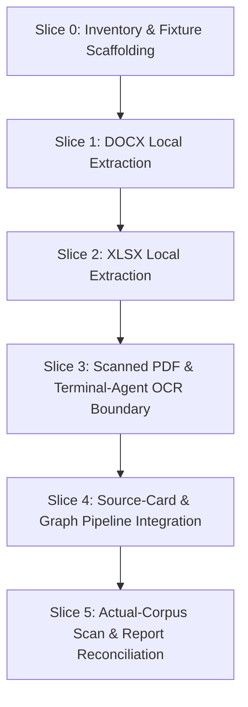

# M014 — Private Knowledge Coverage Expansion

Status: `accepted`

Date drafted: 2026-08-08

Date accepted: 2026-08-08

Approval authority: user

Depends on: [`M012-private-knowledge-corpus-and-graph-foundation.md`](M012-private-knowledge-corpus-and-graph-foundation.md) (completed M012 baseline), [`DEC-0019`](../decisions/DEC-0019-private-knowledge-corpus-boundary.md) (private knowledge subsystem boundary), [`DEC-0017`](../decisions/DEC-0017-cli-terminal-workflow-and-concurrency-model.md) (terminal-agent orchestration boundary), [`ADR-0006`](../decisions/ADR-0006-m001-stack.md) (local SQLite runtime & offline verification), [`DEC-0014`](../decisions/DEC-0014-local-only-scope-reaffirmation.md) (local-only boundary), and [`DEC-0012`](../decisions/DEC-0012-ocr-vision-provider-eligibility.md) (POC vision provider eligibility for optional OCR).

---

## 1. Title and status

- **Title**: M014 — Private Knowledge Coverage Expansion
- **Status**: `accepted`
- **Date**: 2026-08-08

*(Note: This milestone packet is accepted for implementation and verification.
It is not active or complete.)*

---

## 2. Outcome

### Product Position: Private Knowledge as an Analysis Substrate

M014 positions the private knowledge subsystem as a **source-traceable
analysis substrate for user-led analysis** of the educational corpus. It helps
the user retrieve, compare, connect, and interrogate frameworks, concepts,
mechanisms, indicators, claims, and limitations while preserving the path back
to the originating document location.

The subsystem supplies structured material for analysis; it does not supply
current verified market evidence or an automatic investment conclusion. A
`graph_ready` claim remains a provenance-checked candidate knowledge record,
not approved truth. Interpretation, relevance, and any investment decision
remain with the user.

M014 expands local extraction coverage for the private educational corpus under `originals/` without violating any local, privacy, provenance, or architecture boundaries established in M012 and [`DEC-0019`](../decisions/DEC-0019-private-knowledge-corpus-boundary.md):

1. **Locally Inspectable Office Documents**: The 24 currently unsupported Office files (22 `.docx` files and 2 `.xlsx` files) will yield deterministic, validated local extraction artifacts containing structured canonical text, sheet/paragraph locators, tables, and formula representations.
2. **Explicit OCR Decision Boundary**: The single scanned PDF currently marked `needs_ocr` (and any future image source) will have a clear, explicit, off-by-default OCR path led by a user-invoked, vision-capable terminal agent. The same provider-neutral file-backed contract is available regardless of whether the user invokes Gemini, Codex, Claude, or another selected terminal agent, with a local deterministic OCR alternative evaluated separately under [`DEC-0017`](../decisions/DEC-0017-cli-terminal-workflow-and-concurrency-model.md) and [`DEC-0019`](../decisions/DEC-0019-private-knowledge-corpus-boundary.md).
3. **Strict Separation of Extraction vs. Digest/Graph**: Office and OCR parsing produces validated local extraction artifacts (`status: 'extracted'`). Source-card batching (`status: 'digested'`) and candidate graph building (`status: 'graph_ready'`) occur ONLY when valid file-backed provider responses exist under `private/knowledge/batches/input/`. Successful extraction does NOT automatically promote a document to `graph_ready`.
4. **Preserved Provenance & Graph Integrity**: Extracted content from expanded formats feeds directly into the existing provider-neutral source-card validation (`knowledgeSourceCardSchema`), strict exact quote verification (`canonicalText.includes(quote)`), candidate claim extraction, and candidate graph builder without modifying existing SQLite database graph schemas.
5. **Strict Subsystem Isolation**: Private course material will remain 100% isolated from live `Evidence`, `SourceSnapshot`, `theses`, `assumptions`, portfolio holdings, research jobs, and investment decision workflows. No course claim will ever be treated as a current verified market fact or auto-promoted into live research.

---

## 3. Current-state evidence

### M012 Baseline Inventory
As established in [`docs/milestones/M012-private-knowledge-corpus-and-graph-foundation.md`](M012-private-knowledge-corpus-and-graph-foundation.md):

- **54** total unique source documents enumerated across `originals/MODULE 1/` and `originals/MODULE 2/`.
- **0** exact content duplicates (0 duplicate manifest entries).
- **29** documents successfully extracted (PDFs/text), digested via deterministic source cards, and marked `graph_ready`.
- **24** Office documents currently marked `unsupported`:
  - **22** `.docx` Word documents
  - **2** `.xlsx` Excel spreadsheets
  - **0** legacy `.doc` or `.xls` binary Office files found in the current corpus.
- **1** scanned PDF currently marked `needs_ocr` (zero text layer extracted by `pdfjs-dist`).
- **0** extraction failures.
- **0** documents awaiting provider (when using deterministic local fixtures).
- **0** claims lacking provenance.
- **0** candidate graph edges without valid source claim IDs.

### Repository Context & Plan File Status
The repository does not contain `EXECUTION_PLAN.md`, `BUILD_PLAN.md`, or
`DATA_MODEL.md`; they are not active authorities for this codebase and no
contents are invented for them. The relevant current sources of truth for M014
are:

- [`AGENTS.md`](../../AGENTS.md) — context routing and the CLI product constitution;
- [`ACTIVE_MILESTONE.md`](../../ACTIVE_MILESTONE.md) — the one canonical current
  milestone/status file at the repository root;
- [`SESSION_CHECKPOINT.md`](../../SESSION_CHECKPOINT.md) — the one canonical
  session handoff/history file at the repository root;
- [`CODEBASE_MAP.md`](../CODEBASE_MAP.md) — module ownership, architecture,
  invariants, and task-specific routing;
- [`ROADMAP.md`](ROADMAP.md) — milestone sequence and recorded scope;
- [`decisions/INDEX.md`](../decisions/INDEX.md) — decision-record navigation;
- [`CLI_WORKFLOW.md`](../CLI_WORKFLOW.md) and
  [`DEC-0017`](../decisions/DEC-0017-cli-terminal-workflow-and-concurrency-model.md)
  — terminal-agent orchestration and concurrency boundaries;
- this M014 packet — the accepted planning packet under implementation.

There is no duplicate `docs/ACTIVE_MILESTONE.md` or
`docs/SESSION_CHECKPOINT.md` authority; the root-level files above are
canonical.

### Baseline Caveat
The 25 remaining unprocessed documents (22 DOCX + 2 XLSX + 1 scanned PDF) cannot be assumed to be 100% parseable by default. M014 requires a formal format inventory, MIME verification, and fixture-based validation before claiming full extraction coverage across all 25 items.

---

## 4. Scope

### A. Office Document Inventory
- **Format Inspection**: Enumerate the 24 unsupported Office files by relative path, file size, SHA-256 hash, exact extension (`.docx`, `.xlsx`), and MIME type.
- **Corpus Reality**: The current corpus contains 22 `.docx` files and 2 `.xlsx` files. No legacy `.doc` or `.xls` binary files exist in `originals/`.
- **Structure Categorization**: Classify each file by internal structural features:
  - Text paragraphs, headings, lists, footnotes.
  - Data tables, multi-sheet workbooks, hidden sheets/rows/columns.
  - Cell formulas vs. displayed values.
  - Embedded images, drawings, charts, macro scripts, or OLE objects.
- **Privacy & Logging Rule**: File content must never be printed to stdout/stderr or written to un-ignored log files during scanning or inventory reporting. Only hashes, relative paths, MIME types, sizes, and error codes may be emitted.

### B. DOCX Extraction
Plan a local, deterministic parser for Word documents (`.docx`):
- **Paragraphs & Headings**: Preserve paragraph boundaries, heading levels (H1–H6), and structural ordering.
- **Tables**: Parse table rows and cells into canonical text representations with cell coordinate locators (e.g., `Table 1, Row 2, Col 1`).
- **Locators**: Generate section/paragraph locators (e.g., `Section 2, Paragraph 14`) so candidate claims retain locators.
- **Document Metadata**: Extract document title, author, and creation date if present in `docProps/core.xml`.
- **Limitations**: Explicitly classify embedded images, vector graphics, shapes, macros (`.docm`), and embedded OLE objects as unsupported sub-elements, recording an explicit safety/limitation flag in the extraction artifact rather than failing the entire document or guessing text.
- **Schema & Compatibility**: Adding `extractionMethod: 'docx_parser'` widens the `extractionMethod` Zod enum in `lib/knowledge/types.ts` while maintaining `schemaVersion: 1` backward compatibility.

### C. XLSX Extraction
Plan a local, deterministic parser for Excel workbooks (`.xlsx`):
- **Workbooks & Sheets**: Enumerate all sheet names in workbook order.
- **Hidden Sheets**: Identify visible vs. hidden sheets (`sheet.Hidden`), prefixing hidden sheet locators explicitly (e.g., `[Sheet: SheetName (Hidden)]`).
- **Cell Extraction**: Extract cell coordinates (e.g., `Sheet1!B12`), cell data types (string, number, boolean, date), formula expressions (e.g., `=SUM(A1:A10)`), and rendered/displayed values.
- **Formulas vs. Values**: Capture both formula text AND displayed values in canonical text (e.g., `[Formula: =SUM(A1:A10) | Value: 1500]`). Never silently evaluate or execute cell formulas at extraction time, and never convert unparsed formulas into factual claims.
- **Merged & Empty Cells**: Handle merged ranges by associating text with the top-left cell coordinate; skip empty whitespace rows while preserving row/column coordinate locators.
- **Tables & Ranges**: Segment tabular ranges into canonical text blocks that preserve 2D grid structure.
- **Schema & Compatibility**: Adding `extractionMethod: 'xlsx_parser'` widens the `extractionMethod` Zod enum in `lib/knowledge/types.ts` while maintaining `schemaVersion: 1` backward compatibility.

### D. OCR Path for Scanned PDF
Define an explicit, safe decision path for the 1 `needs_ocr` PDF (and any image source):
- **Primary operator path — terminal-agent vision OCR**: The user may explicitly
  invoke any vision-capable terminal agent available in the user's terminal.
  Gemini, Codex, Claude, or another explicitly selected agent may use the same
  provider-neutral contract. The terminal agent reads the scanned source locally and
  writes a strict file-backed OCR handoff into an ignored private OCR-input
  directory; the jp-invest application then validates and ingests that handoff.
  The application does not launch Gemini, Codex, Claude, or any other agent.
- **Provider-neutral handoff**: The handoff contract records the source hash,
  source-relative path, OCR text/pages, provider name, model identifier, and
  prompt version. A dedicated OCR-input
  contract is separate from `private/knowledge/batches/input/`, which remains
  the source-card digest input contract. The exact OCR-input path and schema
  are implementation decisions for M014-B. The handoff is the OCR provider
  boundary for this milestone; it is not a provider adapter inside `lib/ai/`.
- **Terminal boundary**: This follows [`DEC-0017`](../decisions/DEC-0017-cli-terminal-workflow-and-concurrency-model.md): a terminal agent is an external orchestrator, not an `LLMProvider` swap inside jp-invest. No app route or knowledge CLI command may silently invoke a model. The app consumes only the validated local handoff and records the provider metadata.
- **Provider-neutral boundary**: No terminal agent is approved as an in-app
  provider by this milestone. [`DEC-0012`](../decisions/DEC-0012-ocr-vision-provider-eligibility.md)
  remains limited to its previously evaluated Ollama POC capability and does
  not govern this file-backed terminal handoff. Any selected terminal-agent
  route still requires explicit provider selection, credentials, consent, and
  local deterministic verification under [`DEC-0019`](../decisions/DEC-0019-private-knowledge-corpus-boundary.md).
- **Local OCR alternative**: A deterministic local WebAssembly/native OCR tool
  (for example, `tesseract.js` with offline language data) may be evaluated as
  an offline alternative, but M014-B must not require it before the explicit
  terminal-agent handoff path is assessed.
- **Off by default**: No provider process or network call is enabled by
  default. A no-handoff run leaves the document at `needs_ocr`; an explicit
  terminal-agent run produces a handoff that must pass local validation before
  the document can become `extracted`.
- **Metadata Storage Design Choice**: After local handoff validation,
  provider/model/prompt metadata (`provider`, `modelId`, `promptVersion`) is
  recorded in the SQLite tables `knowledge_documents` and
  `knowledge_processing_runs`. `KnowledgeExtractionArtifact` remains focused
  on the validated local text payload unless M014-B proves that the handoff
  contract itself needs a separate versioned metadata field.
- **Exact Quote Invariant**: OCR output must strictly satisfy the exact substring invariant `canonicalText.includes(quote)`. Proposing normalized or fuzzy matching as equivalent is not permitted; any relaxed or fuzzy OCR quote matching requires a separate, explicitly scoped decision with a documented provenance risk evaluation.
- **No Promotion to Verified Evidence**: OCR output from private course materials remains in the private knowledge subsystem and can never be promoted into live research `Evidence`.

### E. Source-Card and Graph Compatibility
Ensure Office and OCR extractions seamlessly integrate into the existing M012 pipeline:
- **Extraction Artifact Schema**: Modify `knowledgeExtractionArtifactSchema` (`lib/knowledge/types.ts`) to add `'docx_parser'`, `'xlsx_parser'`, and `'ocr'` to the `extractionMethod` enum under `schemaVersion: 1`, producing canonical JSON files under `private/knowledge/extracted/<hash>.json`.
- **State Machine Separation**:
  - `extracted`: Local parsing completes successfully, creating `private/knowledge/extracted/<hash>.json`.
  - `awaiting_provider`: Document is extracted but no file-backed provider response exists under `private/knowledge/batches/input/`.
  - `digested`: Valid source-card JSON response is ingested and validated against `knowledgeSourceCardSchema` (`lib/knowledge/types.ts`).
  - `graph_ready`: Provenance-checked claims and candidate nodes/edges are persisted in SQLite and exported under `private/knowledge/graph/`.
- **Source-Card Validation**: Source cards generated from DOCX/XLSX/OCR extractions must validate against `knowledgeSourceCardSchema` (`lib/knowledge/types.ts`).
- **Exact Quote Invariant**: Every claim quote in a source card must pass strict verbatim substring verification:
  ```ts
  canonicalText.includes(quote)
  ```
  Normalized or fuzzy matching is not an equivalent substitute.
- **Batch & Graph Artifacts**: Extracted Office files produce batch artifacts under `private/knowledge/batches/` and provenance-linked candidate nodes/edges under `private/knowledge/graph/` only when provider responses are present.
- **Resumability & Retries**: Documents with hash-matched existing artifacts skip re-extraction unless `--force` is specified. Failed documents record structured error codes and permit safe individual retry.

---

## 5. Out of scope

The following areas are strictly **excluded** from M014:

- **UI for Graph Approvals**: No web interface or review UI for approving candidate graph nodes/edges.
- **Live System Promotion**: No promotion of course claims to `Evidence`, `SourceSnapshot`, `discoveryCandidates`, or `portfolioAlerts`.
- **Thesis & Portfolio Integration**: No automatic creation or modification of theses, assumptions, measurement contracts, or portfolio positions from course material.
- **Investment Action Suggestions**: Zero generation of "Buy", "Hold", "Reduce", "Exit", or "Sell" recommendations (`AGENTS.md` Rule 2).
- **Automatic Market Interpretation**: Course concepts are educational frameworks, never current market facts or real-time trading signals.
- **Default External Network Calls**: No default network routing to OpenAI, Gemini, Anthropic, Ollama Cloud, or Tavily during build, test, lint, or standard CLI execution.
- **Source Archive Mutation**: Zero deletion, renaming, moving, flattening, or rewriting of files inside `originals/`.
- **Semantic Relevance Solving (R-025)**: R-025 live evidence relevance filtering belongs to research pipeline milestones, not private knowledge expansion.
- **Production Hosted Processing**: Production cloud hosting or remote database storage remains out of scope under [`DEC-0014`](../decisions/DEC-0014-local-only-scope-reaffirmation.md).

---

## 6. Proposed implementation slices

M014 is structured into 6 incremental vertical slices:



### Slice 0: Document Inventory & Parser-Fixture Selection
- **Outcome**: Exact structural report of all 22 DOCX documents, 2 XLSX documents, and 1 scanned PDF; selection and benchmarking of local Office parsing libraries against synthetic fixtures.
- **Files Affected**: `scripts/knowledge.ts`, `lib/knowledge/intake.ts`, `lib/knowledge/types.ts`, `tests/knowledge.test.ts`.
- **Schema Impact**: None (uses existing `knowledge_documents` and `knowledge_processing_runs`).
- **Tests Required**: Inventory scan unit tests, file extension/MIME detection tests, synthetic fixture verification.
- **Failure States**: Unreadable file permissions, corrupted zip headers, symlink escape attempts.
- **Rollback Strategy**: Revert script and helper changes; clear temporary inventory reports.
- **Acceptance Criteria**: `npm run knowledge:scan` outputs exact breakdowns of Office formats without reading text into logs or modifying `originals/`.

### Slice 1: DOCX Local Extraction
- **Outcome**: Deterministic extraction of `.docx` files into `KnowledgeExtractionArtifact` JSON documents with paragraph/heading locators and table structures (`status: 'extracted'`).
- **Files Affected**: `lib/knowledge/types.ts`, `lib/knowledge/extraction.ts`, `lib/knowledge/office/docx.ts` (new), `tests/knowledge-docx.test.ts` (new).
- **Schema Impact**: **Requires Schema Modification** — update `knowledgeExtractionArtifactSchema` in `lib/knowledge/types.ts` to add `'docx_parser'` to the `extractionMethod` enum under `schemaVersion: 1` (Option A backward-compatible enum widening).
- **Tests Required**: Paragraph extraction, heading hierarchy (H1-H6), table cell grid formatting, locator generation, safety injection scanning, malformed `.docx` failure handling.
- **Failure States**: Password-protected DOCX, corrupted XML inside docx zip container, malformed tables.
- **Rollback Strategy**: Revert `lib/knowledge/types.ts` schema addition and `lib/knowledge/office/docx.ts`; purge `private/knowledge/extracted/` DOCX artifacts.
- **Acceptance Criteria**: Valid `.docx` files extract to JSON artifacts with non-empty `canonicalText`, structured `pages`/locators, `extractionMethod: 'docx_parser'`, and `sourceVariant: 'text_layer'`.

### Slice 2: XLSX Local Extraction
- **Outcome**: Deterministic extraction of `.xlsx` files into `KnowledgeExtractionArtifact` JSON documents with sheet names, cell coordinates, formula text, displayed values, and table ranges (`status: 'extracted'`).
- **Files Affected**: `lib/knowledge/types.ts`, `lib/knowledge/extraction.ts`, `lib/knowledge/office/xlsx.ts` (new), `tests/knowledge-xlsx.test.ts` (new).
- **Schema Impact**: **Requires Schema Modification** — update `knowledgeExtractionArtifactSchema` in `lib/knowledge/types.ts` to add `'xlsx_parser'` to the `extractionMethod` enum under `schemaVersion: 1` (Option A backward-compatible enum widening).
- **Tests Required**: Multi-sheet extraction, hidden sheet detection, cell locator formatting (`Sheet1!A1`), formula preservation, numeric/date formatting, merged cell handling, malformed `.xlsx` error reporting.
- **Failure States**: Encrypted/password-protected workbooks, corrupt zip archives, circular formula references in cached values.
- **Rollback Strategy**: Revert `lib/knowledge/types.ts` schema addition and `lib/knowledge/office/xlsx.ts`; remove extracted XLSX artifacts.
- **Acceptance Criteria**: Valid `.xlsx` workbooks produce JSON artifacts preserving sheet hierarchy, cell locators, formula text, and displayed values without evaluating arbitrary code.

### Slice 3: Explicit OCR Boundary & Scanned Document Handling
- **Outcome**: Scanned PDFs and image files receive an explicit, consent-gated terminal-agent OCR handoff path with structured provider/model metadata stored in database tables `knowledge_documents` and `knowledge_processing_runs` and `sourceVariant: 'scanned'`.
- **Files Affected**: `lib/knowledge/types.ts`, `lib/knowledge/extraction.ts`, `lib/knowledge/ocr.ts` (new), `tests/knowledge-ocr.test.ts` (new).
- **Schema Impact**: **Requires Schema Modification** — update `knowledgeExtractionArtifactSchema` in `lib/knowledge/types.ts` to add `'ocr'` to `extractionMethod` enum under `schemaVersion: 1` (Option A backward-compatible enum widening). OCR provider metadata (`provider`, `modelId`, `promptVersion`) is stored in SQLite tables `knowledge_documents` and `knowledge_processing_runs` (Option 2 metadata design).
- **Tests Required**: Scanned PDF detection, missing OCR handoff handling (`errorCode: 'ocr_handoff_missing'`), malformed or hash-mismatched handoff JSON, prompt injection safety scanning on OCR output, metadata validation, and the no-network application boundary.
- **Failure States**: Missing or incomplete terminal-agent handoff, source hash/path mismatch, missing provider metadata, unreadable low-resolution scan, or malformed OCR JSON response. Provider-side timeouts remain outside the application process and are represented by a missing or failed handoff.
- **Rollback Strategy**: Revert OCR boundary module and artifact schema extensions; documents revert to `needs_ocr` status in SQLite.
- **Acceptance Criteria**: Scanned PDFs produce extraction artifacts with `sourceVariant: 'scanned'`, `extractionMethod: 'ocr'`, and complete provider metadata recorded in `knowledge_documents`/`knowledge_processing_runs` only after an explicitly authorized terminal-agent handoff passes local validation; without a handoff, the document remains `needs_ocr`.

### Slice 4: Source-Card, Quote, Provenance & Graph Integration
- **Outcome**: Extracted Office and OCR artifacts flow through `knowledge:batch` and `knowledge:graph` pipeline commands when valid file-backed provider responses exist under `private/knowledge/batches/input/`, generating provenance-linked claims and graph records (`status: 'digested'` -> `status: 'graph_ready'`).
- **Files Affected**: `lib/knowledge/batch.ts`, `lib/knowledge/graph.ts`, `scripts/knowledge.ts`, `tests/knowledge.test.ts`.
- **Schema Impact**: None on SQLite database tables; validates against `knowledgeSourceCardSchema`.
- **Tests Required**: DOCX/XLSX/OCR source-card validation via `knowledgeSourceCardSchema`, strict `canonicalText.includes(quote)` verification against Office `canonicalText`, claim-to-graph edge provenance enforcement, batch artifact generation.
- **Failure States**: Quote mismatch between source card and DOCX/XLSX canonical text, missing source claim IDs in graph edge creation.
- **Rollback Strategy**: Delete generated batch and graph artifacts from `private/knowledge/batches/` and `private/knowledge/graph/`; clear `knowledge_claims`, `knowledge_graph_nodes`, and `knowledge_graph_edges` rows via database restore.
- **Acceptance Criteria**: 100% of claims generated from Office/OCR documents satisfy `canonicalText.includes(quote)`, and 100% of graph edges contain valid source claim IDs. In a no-provider run with no batch input files, extracted documents transition to `awaiting_provider` without throwing errors.

### Slice 5: Actual-Corpus Scan, Report Reconciliation & Close-Out
- **Outcome**: Full execution against the actual 54-document `originals/` corpus; reconciliation of the summary QA report; standard system verification.
- **Files Affected**: `lib/knowledge/report.ts`, `scripts/knowledge.ts`, `docs/milestones/M014-private-knowledge-coverage-expansion.md`.
- **Report Path Design**: The default path remains `private/knowledge/reports/m012-report.json` for backward compatibility. Its generated contents may be replaced atomically by a later report run. M014 must not delete the report file, change its path silently, or remove historical source files. A historical snapshot requires an explicit versioned `--out` path or an explicit user-authorized backup. `m014-report.json` is optional and only exists if a versioned output option is explicitly implemented.
- **Schema Impact**: None.
- **Tests Required**: Full test suite (`npm test`), typecheck (`npm run typecheck`), lint (`npm run lint`), build (`npm run build`), context check (`npm run context:check`), status check (`npm run status:check`), idempotent re-run test.
- **Failure States**: Corpus status mismatch between manifest and SQLite database.
- **Rollback Strategy**: Purge generated reports and artifacts; restore SQLite database from pre-slice backup.
- **Acceptance Criteria**: `originals/` is 100% unchanged; manifest and database are synchronized; total extracted and graph-ready document counts updated accurately; summary report written cleanly without deleting `m012-report.json`.

---

### Library Evaluation for Office Parsing

To maintain determinism, safety, and maintainability without introducing unnecessary native binaries or security vulnerabilities, viable local parsing libraries are evaluated below:

| Feature / Criteria | Option A: `mammoth` (DOCX) + `exceljs` (XLSX) | Option B: `adm-zip` + `fast-xml-parser` (Custom OpenXML) | Option C: `xlsx` (SheetJS) for both/XLSX |
|---|---|---|---|
| **Deterministic Behavior** | Pure JS/TS, high determinism, reproducible output. | 100% deterministic custom DOM/XML traversal. | High determinism, but complex internal codebase. |
| **DOCX Structure & Tables** | Excellent HTML/Text conversion, preserves paragraph & table order. | Requires manual XML mapping for WordprocessingML. | N/A (SheetJS is spreadsheet focused). |
| **XLSX Formulas & Values** | Excellent sheet/cell traversal, formula strings, displayed values, hidden sheets. | Requires manual XML mapping for SpreadsheetML. | Excellent formula and cell reading, but licensing/versioning quirks. |
| **License & Maintenance** | MIT / MIT; clean active TypeScript maintenance. | MIT; zero external parser dependencies. | Apache 2.0 / Custom SheetJS license depending on version. |
| **Node/TS Compatibility** | Native Node.js & ESM/CJS TypeScript support. | Native Node.js & ESM/CJS TypeScript support. | Good Node.js support, typed definitions variable. |
| **Security & Macro Safety** | Never executes macros (`.docm`/`.xlsm`), pure text parsing. | Pure XML parsing; zero script execution risk. | Ignores macros by default; large parser surface. |
| **Locator Preservation** | Preserves section/heading/table locators via HTML/DOM structure. | Exact XML element line/index locators possible. | Cell coordinates (`A1`, `B12`) natively provided. |

#### Parser Library Recommendation
- **DOCX**: Recommend **`mammoth`** (for clean HTML/Text conversion with headings and tables) or low-level OpenXML parsing via standard XML parser.
- **XLSX**: Recommend **`exceljs`** (MIT licensed, excellent TypeScript types, clean workbook/sheet/cell/formula API, hidden sheet detection).
- **Legacy Formats (`.doc`, `.xls`)**: None exist in the current corpus (0 found). If any are encountered in future imports, mark them as `unsupported_legacy_format`.

*(Note: Final selection of new npm packages requires explicit user decision before adding to `package.json`.)*

---

## 7. Product and architecture decisions required before coding

The following 8 explicit decisions form the accepted planning baseline for M014
implementation:

1. **Legacy Binary Office Formats Policy (`.doc`, `.xls`)**: Confirm that legacy pre-2007 binary Office files (none exist in the current corpus) should be deferred or marked `unsupported_legacy_format` if encountered in future intake. *(Recommendation: Defer legacy binary formats; focus M014 on OpenXML `.docx` and `.xlsx`.)*
2. **XLSX Formula Preservation Posture**: Should XLSX extraction preserve (a) displayed cell values only, (b) formula text strings only, or (c) both formula text and displayed value in the extraction locator/canonical text? *(Recommendation: Preserve both formula text and displayed value, e.g., `[Formula: =SUM(A1:A10) | Value: 1500]`.)*
3. **Hidden Sheets in XLSX**: Should hidden sheets in Excel workbooks be extracted and included in knowledge canonical text, or ignored? *(Recommendation: Include hidden sheets, explicitly prefixing locators with `[Sheet: SheetName (Hidden)]`.)*
4. **Artifact Schema Compatibility & OCR Metadata Storage Design**:
   - **Schema Compatibility Choice**: Option A — `schemaVersion: 1` remains backward-compatible by widening the Zod `extractionMethod` enum in `lib/knowledge/types.ts` to include `'docx_parser'`, `'xlsx_parser'`, and `'ocr'`. M014-A owns the DOCX/XLSX additions; M014-B owns the OCR addition.
   - **OCR Metadata Storage Choice**: Option 2 — Provider/model/prompt metadata (`provider`, `modelId`, `promptVersion`) is stored in SQLite tables `knowledge_documents` and `knowledge_processing_runs`, leaving `KnowledgeExtractionArtifact` focused on local text content.
5. **Report Artifact Path & Backward Compatibility Design**:
   - **Standard Default Path**: The default path remains `private/knowledge/reports/m012-report.json` for backward compatibility. Its generated contents may be replaced atomically by a later report run.
   - **Historical Snapshots**: M014 must not delete the report file, change its path silently, or remove historical source files. A historical snapshot requires an explicit versioned `--out` path or an explicit user-authorized backup.
   - **Versioned Path Option**: `m014-report.json` is optional and only exists if a versioned output option is explicitly implemented.
6. **Sub-Milestone Split**: Should M014 be kept as a single milestone, or formally split into **M014-A** (Local Office Parsing for DOCX/XLSX) and **M014-B** (Scanned PDF & Terminal-Agent OCR Boundary)? *(Recommendation: Split into M014-A and M014-B to deliver immediate local Office coverage without blocking on OCR handoff setup.)*
7. **Candidate Graph Review Surface**: Should candidate graph claims/nodes/edges generated from Office files remain purely inspectable via CLI/JSON reports, or is a human review surface required in a future milestone before graph approval? *(Recommendation: Keep candidate graph CLI/JSON inspectable only; defer approval UI.)*
8. **Coverage Target Threshold**: Is 100% extraction coverage of all 25 remaining documents required for M014 completion, or is partial coverage (e.g. all 24 valid Office files extracted, leaving any corrupt file visibly marked) acceptable? *(Recommendation: Accept partial coverage provided every document has an explicit, valid status in the manifest and database.)*

---

## 8. Acceptance criteria

### Overall System Criteria & Repository Integrity
1. **Source Archive Integrity**: `originals/` and all files beneath it remain 100% byte-unchanged. No source file under `originals/` is created, modified, renamed, moved, copied, or deleted.
2. **No Unintended File Modifications**: M014 does not modify any unintended tracked repository file. (A clean repository-wide `git status` is not required, as legitimate pre-existing user changes may exist; verification checks strictly that `originals/` is untouched and no unrelated tracked files are modified.)
3. **No Invalid Directories**: No `private/knowledge/originals/` directory is ever created or referenced.
4. **Relative Path Consistency**: All document paths in manifest and database remain relative to `originals/` (e.g. `MODULE 1/filename.docx`).
5. **Manifest Synchronization**: `private/knowledge/manifest.jsonl` and the SQLite `knowledge_documents` table maintain 1:1 status and error code synchronization.
6. **No Live Pipeline Pollution**: Zero knowledge claims or graph records are inserted into `evidence`, `source_snapshots`, `theses`, `assumptions`, or `portfolio_positions`.
7. **No Investment Recommendations**: No "Buy", "Hold", "Reduce", "Exit", or "Sell" advice is generated or suggested anywhere (`AGENTS.md` Rule 2).
8. **No Unconfigured Provider Calls**: No external HTTP request or API call is made during `npm test`, `npm run build`, `npm run typecheck`, `npm run lint`, or standard CLI execution unless explicitly configured and authorized under [`DEC-0019`](../decisions/DEC-0019-private-knowledge-corpus-boundary.md).
9. **Report Path Preservation**: The default path remains `private/knowledge/reports/m012-report.json` for backward compatibility. Its generated contents may be replaced atomically by a later report run, but M014 must not delete the report file, change its path silently, or remove historical source files. A historical snapshot requires an explicit versioned `--out` path or an explicit user-authorized backup. `m014-report.json` is optional and only exists if a versioned output option is explicitly implemented.
10. **Idempotence & Retries**: Re-running `knowledge:extract`, `knowledge:batch`, or `knowledge:graph` is completely idempotent. Retrying a failed document reprocesses only that document without clobbering unrelated rows.

### State Machine & Format-Specific Criteria

#### Pipeline State Machine
- **`extracted`**: Local parsing completes successfully, writing `private/knowledge/extracted/<hash>.json`.
- **`awaiting_provider`**: Document is extracted, but no file-backed provider response exists under `private/knowledge/batches/input/`. A no-provider run leaves documents in `awaiting_provider` without throwing errors or attempting external network calls.
- **`digested`**: Valid source-card JSON response from `private/knowledge/batches/input/` is ingested and validated against `knowledgeSourceCardSchema` (`lib/knowledge/types.ts`).
- **`graph_ready`**: Provenance-checked claims and candidate nodes/edges are persisted in SQLite and exported under `private/knowledge/graph/`. Successful extraction does NOT automatically mark a document `graph_ready`.

#### DOCX Extraction
- Supported `.docx` files produce valid JSON extraction artifacts under `private/knowledge/extracted/<hash>.json`.
- `knowledgeExtractionArtifactSchema` in `lib/knowledge/types.ts` is updated under `schemaVersion: 1` to include `'docx_parser'` in `extractionMethod`.
- Extraction artifacts contain `schemaVersion: 1`, `sourceDocumentHash`, `sourceRelativePath`, non-empty `canonicalText`, structured `pages` with paragraph/heading locators, `parserVersion`, `extractionMethod: 'docx_parser'`, `sourceVariant: 'text_layer'`, and `untrustedInstructionFlagged`.
- Headings (H1–H6) and tables are converted into structured text blocks with explicit cell locators.
- Password-protected or corrupt `.docx` files fail visibly with `errorCode: 'unsupported_document'` or `'corrupt_office_file'`; never produce guessed text.

#### XLSX Extraction
- Supported `.xlsx` files produce valid JSON extraction artifacts under `private/knowledge/extracted/<hash>.json`.
- `knowledgeExtractionArtifactSchema` in `lib/knowledge/types.ts` is updated under `schemaVersion: 1` to include `'xlsx_parser'` in `extractionMethod`.
- Extraction artifacts capture sheet names, cell coordinate locators (`SheetName!CellRef`), formula text, and displayed values.
- Hidden sheets are explicitly identified in locators (`[Sheet: SheetName (Hidden)]`).
- Formulas are never executed as arbitrary code; unparseable workbooks fail visibly with a structured error code.

#### Scanned PDF & OCR Boundary
- Scanned PDFs with zero text layer remain marked `needs_ocr` when no validated OCR handoff is present.
- `knowledgeExtractionArtifactSchema` in `lib/knowledge/types.ts` is updated under `schemaVersion: 1` to include `'ocr'` in `extractionMethod`.
- When an explicitly authorized terminal-agent OCR handoff is validated, extraction artifacts record `sourceVariant: 'scanned'` and `extractionMethod: 'ocr'`. Provider metadata (`provider`, `modelId`, `promptVersion`) is recorded in `knowledge_documents` and `knowledge_processing_runs`.
- OCR text is scanned for embedded prompt instructions using `detectEmbeddedInstructions`.
- OCR output strictly satisfies the exact quote invariant `canonicalText.includes(quote)`.
- OCR output remains strictly inside the private knowledge subsystem.

#### Security & Instruction-Injection Handling
- All extracted text from Office documents and OCR is processed through `detectEmbeddedInstructions` before saving artifacts.
- If prompt instructions are detected, `untrustedInstructionFlagged` is set to `true` in the extraction artifact.

---

## 9. Verification plan

Execution of the following verification commands must occur after implementation (no commands are run during this planning phase):

### 1. CLI Surface & No-Provider Pipeline Verification
Run the full 5-command CLI sequence:
```bash
npm run knowledge:scan
npm run knowledge:extract
npm run knowledge:batch
npm run knowledge:graph
npm run knowledge:report
```
- **Expected No-Provider Behavior**:
  - `knowledge:scan`: Enumerates 54 total documents (29 PDF/text, 22 DOCX, 2 XLSX, 1 scanned PDF).
  - `knowledge:extract`: Successfully extracts the 22 DOCX and 2 XLSX files (`status: 'extracted'`). The scanned PDF remains `needs_ocr` if no validated terminal-agent handoff or local OCR result is configured.
  - `knowledge:batch`: When no file-backed provider responses are present under `private/knowledge/batches/input/`, extracted documents transition to `status: 'awaiting_provider'`. This is the expected deterministic state, **not an extraction failure**. Zero external network calls are made.
  - `knowledge:graph`: Retains existing 29 graph-ready documents; does not attempt graph generation for documents marked `awaiting_provider`.
  - `knowledge:report`: The default path remains `private/knowledge/reports/m012-report.json` for backward compatibility. Its generated contents may be replaced atomically by a later report run, recording accurate status counts (`extracted`, `awaiting_provider`, `digested`, `graph_ready`). M014 must not delete the report file, change its path silently, or remove historical source files. A historical snapshot requires an explicit versioned `--out` path or an explicit user-authorized backup. `m014-report.json` is optional and only exists if a versioned output option is explicitly implemented.

### 2. Focused Unit & Integration Tests
```bash
# Run knowledge subsystem tests including new Office & OCR suites
npx vitest run tests/knowledge.test.ts tests/knowledge-docx.test.ts tests/knowledge-xlsx.test.ts tests/knowledge-ocr.test.ts
```
- **Fixtures to Test**:
  - Valid synthetic `.docx` with headings, bullet lists, and 2D tables.
  - Valid synthetic `.xlsx` with multiple sheets, hidden sheet, cell formulas, and merged cells.
  - Malformed/corrupt `.docx` and `.xlsx` files asserting visible error codes.
  - Password-protected Office document asserting fail-closed behavior.
  - Scanned PDF fixture asserting `needs_ocr` when no handoff is present and valid extraction when a mock terminal-agent OCR handoff is supplied.
  - Prompt injection string embedded in Office paragraph asserting `untrustedInstructionFlagged: true`.
  - Exact quote verification test asserting `canonicalText.includes(quote)` on extracted Office content.

### 3. Migration & Persistence Round-Trip Checks
```bash
# Verify SQLite knowledge tables and provenance constraints
npx vitest run tests/migrations.test.ts
```

### 4. Code Quality & Build Checks (Local-Only)
```bash
npm run typecheck
npm run lint
npm test
npm run build
npm run context:generate
npm run context:check
npm run status:check
git diff --check
```

### 5. Repository Integrity Verification
- Verify `originals/` directory is 100% byte-unchanged (`git diff --stat originals/` clean).
- Verify no source files were moved, copied, renamed, deleted, or altered.
- Verify no unintended tracked files were modified by M014 execution.

---

## 10. Proposed Draft Risks

*(Note: The risk IDs below represent proposed draft risks for M014 planning. `docs/RISK_REGISTER.md` is not modified by this packet.)*

| Proposed Risk ID | Draft Risk Description | Severity | Proposed Mitigation Strategy |
|---|---|---|---|
| **PR-029** | **Office Parser Fidelity Loss**: Complex DOCX layouts, nested tables, or custom XML tags may produce fragmented canonical text. | Medium | Use structural DOM/XML tree traversal; preserve explicit paragraph and cell coordinates in locators; enforce exact quote matching. |
| **PR-030** | **Formula vs Displayed Value Ambiguity**: XLSX cell formulas may differ from pre-calculated cached values if calculated in Excel. | Medium | Capture both raw formula text and cached displayed value in the canonical text block; never auto-evaluate formulas. |
| **PR-031** | **Hidden Sheet Data Pollution**: Hidden XLSX sheets may contain draft, outdated, or sensitive calculation scratchpads. | Low | Mark hidden sheets explicitly in locators (`[Sheet: Name (Hidden)]`); record hidden status in artifact metadata. |
| **PR-032** | **Embedded Objects & Macros**: `.docx`/`.xlsx` files containing embedded OLE objects or VBA macros (`.docm`/`.xlsm`) could introduce security risks or unparsed text. | High | Treat macros and OLE binaries as unparsed binary attachments; log a safe limitation warning; never execute macro code. |
| **PR-033** | **Encrypted or Password-Protected Files**: Office files with password protection will fail extraction. | Low | Catch decryption errors explicitly; assign `status: 'failed'` and `errorCode: 'encrypted_office_file'`; never hang or crash parser. |
| **PR-034** | **OCR Inaccuracy & Quote Provenance Risk**: OCR errors on scanned PDFs could cause source-card quote matching (`canonicalText.includes(quote)`) to fail. | High | Preserve strict `canonicalText.includes(quote)` invariant. Any relaxed/fuzzy quote matching introduces provenance risk and requires a separate explicit decision. |
| **PR-035** | **Prompt Injection in Office Text**: Educational Office documents might contain instruction-like phrases (e.g. "Ignore previous instructions"). | High | Run all extracted Office text through `detectEmbeddedInstructions`; set `untrustedInstructionFlagged: true`. |
| **PR-036** | **External Provider Data Leak**: Accidentally routing private course materials to an external OCR or LLM provider without explicit consent. | Critical | Keep the application off by default; require a user-invoked terminal-agent handoff, explicit provider selection, credentials, consent, and local validation under [`DEC-0019`](../decisions/DEC-0019-private-knowledge-corpus-boundary.md). |
| **PR-037** | **Schema Incompatibility on Extraction Methods**: Adding new `extractionMethod` values without updating `knowledgeExtractionArtifactSchema` causes runtime Zod validation crashes. | Medium | Explicitly update Zod schema in `lib/knowledge/types.ts` in Slice 1, 2, and 3 under `schemaVersion: 1` (Option A enum widening). |
| **PR-038** | **False Confidence from Successful Parser Run**: Assuming that because a file extracted without throwing, all its content was correctly captured. | Medium | Include character length, page/sheet count, and structural element counts in extraction report for verification. |

---

## 11. Reversal

If M014 must be safely reversed after implementation, follow this procedure:

1. **Database Backup**: Ensure a SQLite database snapshot exists (`db-before-m014-reversal.sqlite`).
2. **Stop Parser Invocations**: Cease execution of `npm run knowledge:extract` and Office parser modules.
3. **Preserve Raw Archive**: Confirm `originals/` remains completely untouched and intact.
4. **Remove Generated Artifacts**: Only upon explicit user authorization, purge generated Office extraction JSON files under `private/knowledge/extracted/`, batch files under `batches/`, and graph files under `graph/`.
5. **Revert Database Rows**: Reset document statuses in `knowledge_documents` for affected Office files back to `status: 'unsupported'` and scanned PDF back to `status: 'needs_ocr'`.
6. **No Source File Deletion**: Source files under `originals/` must NEVER be deleted, altered, or moved during reversal.
7. **Live Research Protection**: Live `Evidence`, `SourceSnapshot`, `theses`, and `portfolio_positions` tables are unaffected by reversal since M014 does not touch them.

---

## 12. Recommendation

### 1. Recommended Slice Order
Execute slices sequentially from 0 through 5:
- **Slice 0**: Document inventory and parser-fixture selection.
- **Slice 1**: DOCX local extraction (update `knowledgeExtractionArtifactSchema` enum).
- **Slice 2**: XLSX local extraction (update `knowledgeExtractionArtifactSchema` enum).
- **Slice 3**: Explicit OCR boundary and scanned-document handling (update schema enum for `ocr`).
- **Slice 4**: Source-card (`knowledgeSourceCardSchema`), quote (`canonicalText.includes(quote)`), provenance, and graph integration.
- **Slice 5**: Actual-corpus scan, report reconciliation, and close-out.

### 2. Decisions Required Before Coding
The eight decisions in Section 7 are recorded as the execution baseline for the
terminal-agent handoff below:

- Legacy `.doc`/`.xls` formats are deferred and remain explicitly unsupported
  if encountered.
- DOCX uses deterministic OpenXML traversal; XLSX uses `exceljs` after the
  dependency is explicitly added and audited.
- XLSX extraction preserves both formula text and the workbook's cached/displayed
  value; formulas are never evaluated by the parser.
- Hidden and `veryHidden` XLSX sheets are included with explicit locators.
- `schemaVersion: 1` remains compatible by widening the extraction-method enum;
  M014-A owns DOCX/XLSX values and M014-B owns `ocr`.
- OCR provider metadata is stored in the existing SQLite metadata columns.
- The default report path remains `private/knowledge/reports/m012-report.json`.
- M014 is split into M014-A (Office parsing) and M014-B (terminal-agent OCR).
- Candidate graph output remains CLI/JSON inspectable; coverage is partial but
  accountable, requiring an explicit status for every remaining document.

### 3. Recommended Sub-Milestone Split
It is recommended to split M014 into two phased packets:
- **M014-A: Private Knowledge Office Parsing**: Slices 0, 1, 2, 4, 5 (DOCX and XLSX local extraction for the 24 unsupported Office documents: 22 DOCX, 2 XLSX).
- **M014-B: Private Knowledge Terminal-Agent OCR Boundary**: Slice 3 (OCR handoff path, the `'ocr'` schema-enum addition, and local validation boundary for the 1 scanned PDF).

### 4. Smallest Safe First Implementation Slice
The smallest safe first implementation slice is **Slice 0 (Document Inventory & Fixture Scaffolding)**:
- Enhances `scripts/knowledge.ts scan` to inspect exact Office extensions and structural MIME types.
- Establishes test fixtures for `.docx` and `.xlsx`.
- Operates entirely in memory and against ignored manifest/test files.
- Makes zero database schema changes, zero source file edits, and zero network calls.

### 5. Execution Handoff

This packet is `accepted`; the handoff does not activate or complete M014.
When the user invokes a terminal-agent execution prompt, the selected agent
must first reread the
repository instructions and preserve the existing dirty working tree. It may
implement only the M014-A/M014-B scope recorded above, must not launch a model
from jp-invest, and must stop with a report if a required decision or dependency
is missing. The first implementation slice remains Slice 0, followed by focused
DOCX/XLSX tests before any OCR handoff work.

### 6. Implementation Verification Record

The accepted implementation has been exercised against the actual local corpus
without changing `originals/` or launching an external provider:

- `knowledge:scan`: 54 files, 0 duplicates, 0 failed files.
- `knowledge:extract`: 24 Office documents extracted (22 DOCX, 2 XLSX), 1
  scanned document retained as `needs_ocr`, 0 extraction failures.
- `knowledge:batch`: 24 extracted documents moved to `awaiting_provider` with
  no provider configured.
- `knowledge:graph`: existing 29 `graph_ready` documents retained; no new
  graph promotion from `awaiting_provider`.
- `knowledge:report`: `graph_ready: 29`, `awaiting_provider: 24`,
  `needs_ocr: 1`, zero duplicate/provenance/edge-integrity violations, and the
  default `private/knowledge/reports/m012-report.json` path preserved.
- Verification: 401 tests passed / 3 skipped, typecheck passed, build passed,
  lint exited 0 with three warnings in unrelated user utility files, and
  `git diff --check` passed.

M014 remains `accepted`; this record does not mark it `active` or `complete`.

### 7. OCR Handoff Verification Record

The user-invoked terminal-agent handoff for the scanned PDF was subsequently
validated and ingested locally. The handoff records `provider:
codex-terminal-agent`, `modelId: gpt-5`, `promptVersion: m014-b-ocr-v1`, and 42
ordered pages. `knowledge:extract` converted the document to `extracted`, and
the no-provider batch then moved it to `awaiting_provider` alongside the 24
Office documents. The report therefore now records `graph_ready: 29`,
`awaiting_provider: 25`, and no `needs_ocr` or extraction failures. This is
successful OCR extraction, not source-card digest or graph approval.

### 8. Slice 4 Execution Record

The 25 file-backed source-card inputs were manually validated before execution:
25/25 source hashes and paths matched, all 25 claims had exact quotes present
in their extraction artifacts, and there were zero validation errors. The
local Slice 4 pipeline then completed with:

- `knowledge:batch`: 25 digested, 0 awaiting provider, 0 failed.
- `knowledge:graph`: 25 graph-ready, 0 failed; 75 nodes and 50 edges created
  for the expanded documents.
- `knowledge:report`: all 54 documents are `graph_ready`; zero duplicate,
  extraction, provenance, or invalid source-claim-edge errors.

This execution does not change the private-knowledge boundary: all generated
claims and graph records remain candidate/private knowledge and never enter the
live evidence hierarchy.
