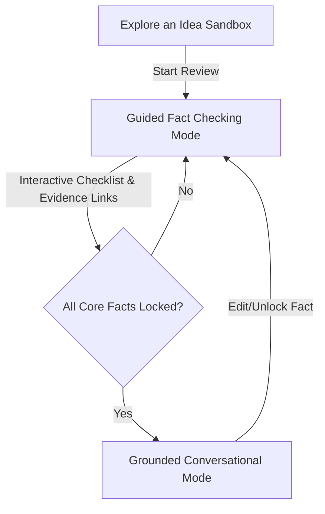

# UX Review: Milestone 7 Specification (Round 2)
**Role:** Senior Product Designer  
**Focus:** Mental models, UI state transitions, interaction design, and aligning M7 execution with the core `PRODUCT_STRATEGY.md`.

This second-pass review dives into the micro-interactions, copy writing, and flow state transitions within [m7_spec.md](file:///D:/jp-invest/docs/milestones/m7_spec.md). It outlines design recommendations to bridge the gap between "simple plain-language" onboarding and "rigorous investment committee (IC) discipline" as outlined in the core product strategy.

---

## 1. The Sandbox-to-Ledger Bridge: Transitioning from "Explore" to "Review"

### The Issue
Under M7, `Explore an idea` is temporary and local-only, which prevents junk data from polluting the workspace. However, if a user spends 15 minutes in the Explore sandbox conducting broad screeners and framing qualitative notes, clicking `Start review` or `Save to watchlist` must not result in a "blank slate." Discarding their session effort causes massive friction and user frustration.

### Design Recommendation
- **The "Triage Clipboard":** When the user triggers `Start review` or `Save to watchlist`, the system should automatically package the Explore chat transcript and key generated insights.
- **Evidence Locker Integration:** This packaged bundle should be injected into the newly created review's Evidence Locker as an *Unverified Draft Note* (labeled *"Imported from Exploration"*). 
- **UX Copy/Action:**
  > [!TIP]
  > Upon transitioning, display a confirmation banner: 
  > *"Review started for [Asset]. We've saved your exploration notes and sources directly into the Evidence Locker as draft inputs."*

---

## 2. The "Check the Facts" Interface: Transitioning from Form to Chat

### The Issue
Line 120 states: *"During pre-verification mode, the screen should feel like guided fact checking, not generic chat."* Line 122 states: *"After facts are confirmed, grounded follow-up can become more conversational."* 

An abrupt switch from a structured data table to a chat box creates a jarring shift in mental models. Users need to understand *why* the conversation unlocked and what state their thesis is in.

### Design Recommendation
- **Split-Screen Workspace:** Use a persistent two-panel layout:
  - **Left Panel (The Thesis Ledger):** Displays the core thesis, locked valuation figures, and evidence links.
  - **Right Panel (The Assistant Console):** Guides the user through verification steps.
- **The Wizard State (Pre-Verification):** The right panel displays progress steps (e.g., *Step 1: Verify Revenue ($50M)*, *Step 2: Confirm Ownership / Cap Table*). The text entry is constrained to helping answer the active step.
- **The Unlocked State (Post-Verification):** Once facts are locked, the left panel switches to a "Locked" visual state (subtle green badge, padlock icons), and the right panel morphs into a standard open-ended conversational box.
- **Reversibility:** Clicking any padlock icon in the left panel to edit a figure instantly switches the right panel back into guided-verification mode for that specific field.

---

## 3. Graceful Private-Asset Routing: Intent Over Architecture

### The Issue
For startup/private-asset routing, the spec notes: *"if the user has structured metrics... route to engine-backed path; if they have qualitative material... route to manual/private workflow"* (Lines 128-132). 

Asking the user to judge if their information is "structured enough" before choosing a path forces them to understand the database architecture, violating the UX requirement: *"route users by intent, not by system architecture."*

### Design Recommendation
- **Single Intake Front Door:** Replace separate manual vs. engine entry buttons with a single "Track Startup or Private Business" input field.
- **Dynamic Scaffolding:** Offer a single drop-zone / text area: *"Paste deck copy, upload a pitch deck PDF, or write a description."*
- **Background Assessment:**
  - If the uploaded content contains extractable metrics (e.g., ARR, LTV, Margin), show a dynamic toast: 
    > *"We identified financial metrics in your upload. We've enabled the modeling engine for this review. [Keep Manual instead]"*
  - If the content is purely qualitative, default to the manual workflow without calling it "basic" or "fallback." Emphasize the qualitative pillars (What it is, What it's worth, What could go wrong).

---

## 4. "Needs Fact Check" for Manual Assets: Avoiding Homework Anxiety

### The Issue
Manual assets rely on manual input. If the user is forced into a `Needs fact check` state, seeing a screen filled with empty inputs, alert icons, or warning colors (orange/red) creates "homework anxiety." The user might abandon the intake flow if it feels like a chore.

### Design Recommendation
- **Progressive Disclosures:** Avoid displaying a long list of blank fields.
- **Minimal Viable Thesis (MVT):** To transition a manual asset from `Not started` to `Ready for review`, require only two inputs: 
  1. *The Thesis* (Why this asset matters)
  2. *The Catalyst* (When to check it again)
- **Neutral States:** Display all other manual fields (e.g., LTV, CAC, Runway) as optional, using soft neutral styling rather than warning styles. Use copy like: *"Optional details: Add metric to unlock financial projections when ready."*

---

## 5. Visual Distinction: Temporary Sandbox vs. Saved Review

### The Issue
Since M7 establishes a clear boundary between temporary exploration (local-only) and saved reviews, the user must never wonder: *"Is my work saved?"* 

### Design Recommendation
- **Theme Differentiation:**
  - **Explore Sandbox:** Use a lighter, warm-tinted background (or a subtle yellow/amber top banner) with a persistent watermark or header label: `🧪 Temporary Sandbox — Not Saved`.
  - **Saved Review:** Use the primary deep, professional theme (dark slate/navy blue) with clear persistent save state indicators (`💾 Saved to Watchlist` or `📂 Saved Review`).
- **Interactive Saved Feedback:** When clicking `Save to watchlist`, do not just display a generic toast. Display a mini-card pointing to where it went:
  > *"Saved to watchlists. [Go to watchlist] | [Create custom reminder]"*

---

## 6. Actionable Recovery Paths for Unsupported Requests

### The Issue
Line 155 states: *"Unsupported requests inside a saved review must not end in refusal-only copy. They must offer a recovery path."*

### Suggested Recovery Action Mapping

| User Request | System Restriction | Recommended Recovery Option / UI Action |
| :--- | :--- | :--- |
| *"Sync live price feed"* (on a startup/private asset) | Private assets do not have public tickers or live feeds. | *"We can't track live price feeds for private assets. Set a manual review interval to update valuation details? [Set quarterly reminder]"* |
| *"Analyze this stock chart"* (inside a private asset review) | No public market charts available. | *"No public stock data found. Upload a cap table or balance sheet to update the model manually? [Upload source document]"* |
| *"Find public sentiment"* (on a private asset) | No search connector or data coverage. | *"We don't search social channels for private assets to prevent false signals. Add custom research notes or investor communications as evidence instead? [Add note]"* |
| *"Tell me what stocks to buy"* (inside a saved stock review) | System is decision-support, not an advisory engine. | *"We don't make buy/sell recommendations. Try exploring general stock concepts in our Sandbox, or add this specific stock to your watchlist for thesis checking. [Go to Explore Sandbox]"* |
